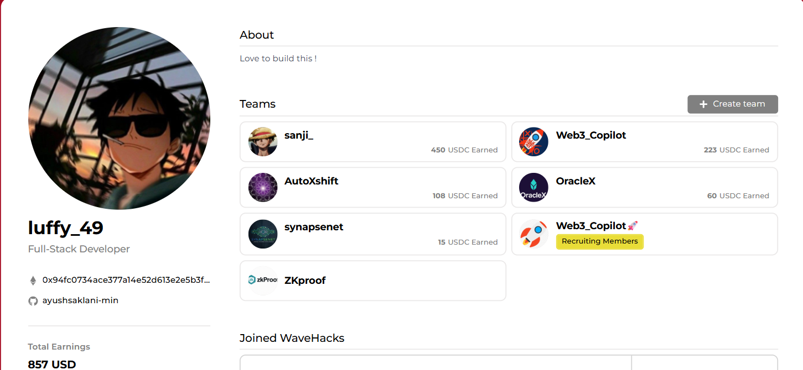

  
  
  
  
  

---

  
  
  
  
  
  
  

---

  
  **🚀 Building the future of Web3, one commit at a time!**
  
  **💜 Love to build this!**

---

## 🎭 About Me

  
  **👤 Ayush Saklani** | **💼 Learning** | **🌍 India**
  
  **🎯 Blockchain & Web3 Enthusiast**
  
  ---
  
  **💻 Tech Stack:**
  
  **Languages:** JavaScript, TypeScript, Rust, Solidity, Python
  
  **Frontend:** React, Next.js, Vite, Tailwind CSS
  
  **Backend:** Node.js, Express, GraphQL
  
  **Blockchain:** Ethereum, Linera, Hardhat, Web3.js
  
  **Oracles:** Chainlink, Pyth Network, CoinGecko
  ---
  
  **🎓 Currently Learning:** Full Stack, AI , ML, Web3
  
  **💡 Interests:** DeFi, Web3, Development ,AI_ML
  
  ---
  
  **🏆 Hackathons:** Polygon Buildathon, Aya AI Buildathon, Linera Buildathon, Sideshift Buildathon
  
  **💰 Total Grants:** 850+ USDC
  
  **🚀 Projects:** Synapsenet, AutoXshift, CopilotX_DeX, OracleX ,AutoXshift
  
  ---
  
  **💬 "Love to build this! 💜"**
  
  **📧 saklaniayush97@gmail.com**
  
  **🚀 Let's build something amazing together!**

---

## 🛠️ Tech Stack & Tools

### 💻 Languages

  
  
  
  
  
  
  
  
  
  

### 🎨 Frontend

  
  
  
  
  
  
  

### ⚙️ Backend

  
  
  
  
  
  

### ⛓️ Blockchain & Web3

  
  
  
  
  
  
  
  

### 🔮 Oracle & Data

  
  
  
  

### 🚀 DevOps & Tools

  
  
  
  
  
  
  
  
  

---

## 🎯 Top Projects

---

### 🤖 [CopilotX DeX](https://github.com/ayushsaklani-min/copilotXDeX)

**AI-powered decentralized exchange (DEX)** — built for seamless trading with AI assistance, advanced smart contracts and multi-chain support.

**Highlights:**
- 💱 Full DEX implementation  
- 🤖 AI Trading Assistant  
- 🔐 Audited smart contracts  
- ⚡ Fast multi-chain transactions  
- 🌐 Cross-chain & liquidity management  

**Tech Stack:** `Solidity` `Hardhat` `JavaScript` `TypeScript` `Web3.js` `Ethers.js` `React` `Next.js` `Tailwind CSS`

**Quick Links:**
- [Repository](https://github.com/ayushsaklani-min/copilotXDeX)

---

### ⚡ [AutoXshift 2.0](https://github.com/ayushsaklani-min/AutoXshift_2.0)

**AI-powered cross-chain financial ecosystem** enabling seamless swaps, portfolio insights, and community-driven fundraising.

**Highlights:**
- 🔁 Cross-chain swaps via SideShift  
- 🧠 AI Portfolio Assistant (Gemini)  
- 📊 Real-time analytics (WebSockets)  
- 🗣️ Social activity feed  

**Quick Links:**
- [Repository](https://github.com/ayushsaklani-min/AutoXshift_2.0)

---

### 🧬 [ZKEVM](https://github.com/ayushsaklani-min/ZKEVM.git)

**Zero-Knowledge Layer-2 solution built for scalability, privacy & high throughput.**

**Highlights:**
- 🔒 Privacy-focused rollup engine  
- 🧠 ZK-proof based transaction validation  
- ⚡ High-throughput L2 architecture  
- 🌐 Designed for multi-chain interoperability  

**Quick Links:**
- [Repository](https://github.com/ayushsaklani-min/ZKEVM.git)

---

## 🏆 Buildathon Achievements

  
  <table>
    <tr>
      <td align="center" width="20%">
        
         
        <b>Polygon Labs</b>
         
        🔨 Building
      </td>
      <td align="center" width="20%">
        
         
        <b>Completed</b>
         
        ✅ Done
      </td>
      <td align="center" width="20%">
        
         
        <b>Building</b>
         
        🔨 In Progress
      </td>
      <td align="center" width="20%">
        
         
        <b>Building</b>
         
        🔨 In Progress
      </td>
      <td align="center" width="20%">
        
         
        <b>Grant Won</b>
         
        🔨 In Progress
      </td>
    </tr>
  </table>
  
  
  

---

  

## 📈 GitHub Trophies

  
  
  

---
## 🔥 Current Focus

  
  <table>
    <tr>
      <td align="center" width="50%">
        
      </td>
      <td align="center" width="50%">
        
      </td>
    </tr>
    <tr>
      <td align="center" width="50%">
        
      </td>
      <td align="center" width="50%">
        
      </td>
    </tr>
  </table>
  

---

## 🎯 Goals for 2025

  
  <table>
    <tr>
      <td align="center" width="50%">
        <ul align="left">
          <li>✅ Explore oracle network</li>
          <li>✅ Contribute to major Web3 protocols</li>
          <li>✅ Build scalable DeFi applications</li>
          <li>✅ Explore Layer 2 solutions</li>
        </ul>
      </td>
    </tr>
  </table>
  

---

## 💬 Let's Connect!

  
  
  

---

## 🎨 Random Dev Quote

  
  
  

---

  
  ### ⚡ "Code is like humor. When you have to explain it, it's bad." ⚡
  
  
  
  
  

---

  
  
  

---

  
  **Made with ❤️ by [ayushsaklani-min](https://github.com/ayushsaklani-min)**
  
  
  
  
  

>>>>>>> 00b714a (Add GitHub profile README with snake animation workflow)

